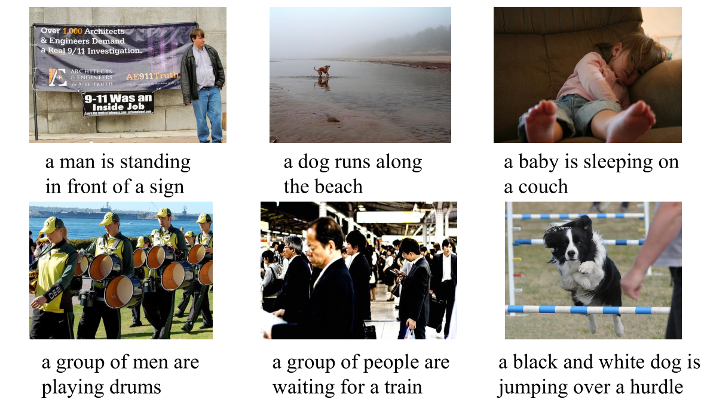
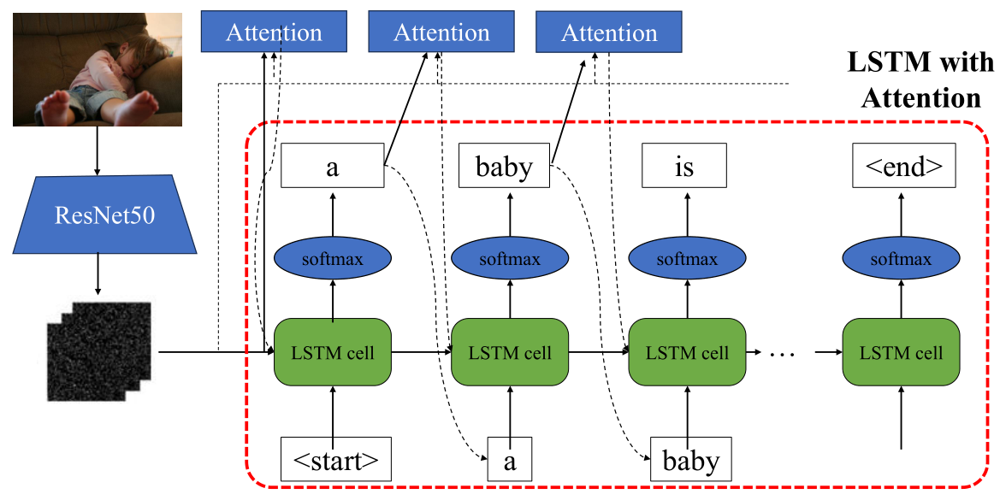

# Image Captioning using Pretrained Word Embeddings

## Overview

Image captioning is a complex task that combines **computer vision** and **natural language processing**. This project investigates the impact of **pretrained word embeddings** on the performance of an image captioning model utilizing a **ResNet-50** encoder and an **LSTM** decoder with an **attention mechanism**. We explore how pretrained embeddings such as **fastText** and **GloVe** can enhance the quality of generated captions and provide a detailed comparison of their effectiveness.

## Features

- Utilizes a **ResNet-50** encoder for extracting image features and an **LSTM** decoder with **attention** to generate context-aware captions.
- Compares the performance of **fastText** and **GloVe** pretrained word embeddings.
- Trained and evaluated on the **Flickr30k** dataset, which includes 31,000 images with 5 human-annotated captions per image.
- Results and findings documented in an **academic paper** format for detailed analysis.

## Results

The experiments showed that using pretrained **GloVe** embeddings yielded the best performance, with an improvement of **2.82%** in the **BLEU-4** score compared to models without pretrained embeddings. Similar improvements were observed across other evaluation metrics such as **ROUGE-L** and **METEOR**.

| Model       | BLEU-4 | METEOR | ROUGE-L |
|-------------|--------|--------|---------|
| No Pretrained Embedding | 24.07% | 19.51% | 45.18% |
| fastText    | 24.12% | 19.50% | 45.48% |
| GloVe       | **24.75%** | **19.81%** | **46.27%** |

## More Information

- **Dataset**: [Flickr8k](https://github.com/goodwillyoga/Flickr8k_dataset), [Flickr30k](https://shannon.cs.illinois.edu/DenotationGraph/)
- **Dataset Split**: [Karpathy Split](https://cs.stanford.edu/people/karpathy/deepimagesent/)
- **Word Embeddings**: [GloVe](https://nlp.stanford.edu/projects/glove/), [FastText](https://fasttext.cc)

## Authors
- Quang-Huy Nguyen
- Hoai-Phong Le
